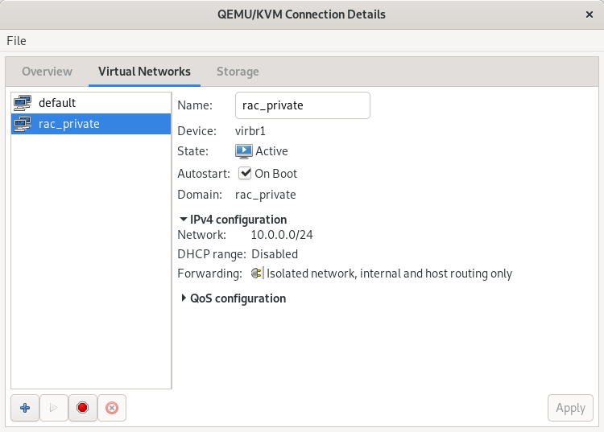
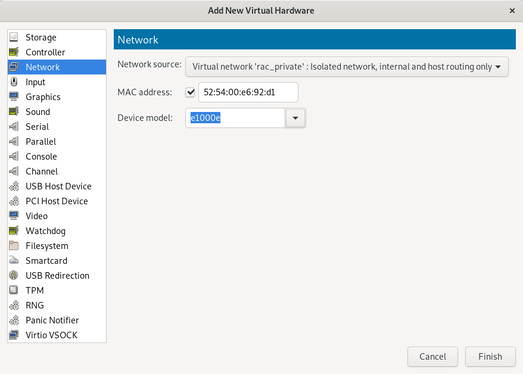
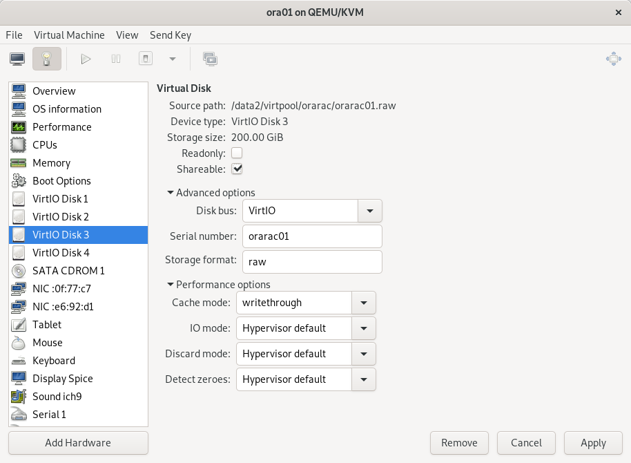
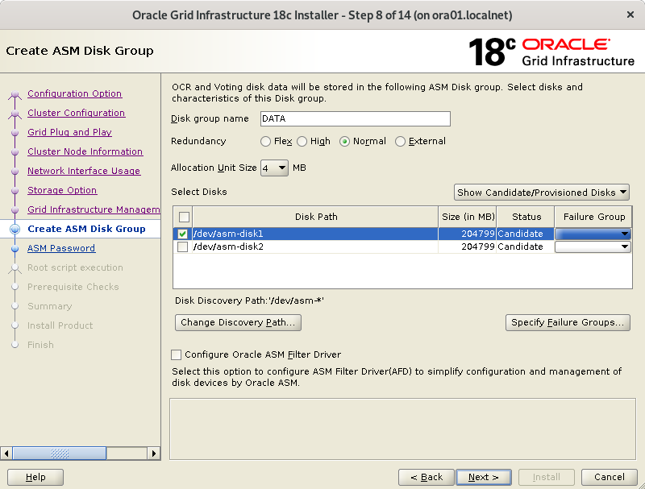

In this post I will go through the different steps to install Oracle grid and set-up a cluster. My host is a fedora and the two guests running oracle will be Centos 7.6 virtual machines. The two small difficulties when setting up a RAC using virtual servers are:

* setting up the networking (it requires a DNS)
* setting up the shared storage
<!--more-->

But before we need to have a Centos 7.6 VM (base install). Once the VM is ready we will clone it. The final set-up will be the following:

* ora01, public IP 192.168.122.10, private IP (for the interconnect): 10.0.0.1
* ora02, public IP 192.168.122.11, private IP (for the interconnect): 10.0.0.2

Scan IP's: 192.168.122.15, 192.168.122.16, 192.168.122.17 (round-robin DNS)

For the private IP's there will be a dedicated virtual network between ora01 and ora02.

For the shared storage, I will use a udev rule to make the disks naming and ownership permanent, the udev rule will use the serial id of the disk which can be assigned when attaching the disk (the disk is just a file on the host) via virt-manager. When attaching the disk to the VM's we will also check the flag "Shareable".

## creating the first guest VM

In order to create the first VM I will use the cloud init image provided by Centos. I made a post here on how to use cloud init: [Clout-init to create centos 7 guests on KVM](http://saule1508.github.io/libvirt-centos-cloud-image/). Basically, 
* create a file ora01.iso using cloud-localds, based on user-data and metadata (take care: on Fedora the module resolv_conf is not working)
* use virt-install to create the VM with 8GB and 4 cpu cores.

```bash
export VMPOOLDIR=/data2/virtpool/ora01

virt-install --name ora01 --memory 8192 --vcpus 4 --disk $VMPOOLDIR/ora01.qcow2,device=disk,bus=virtio --os-type generic --os-variant centos7.0 --virt-type kvm --network=default,model=virtio --cdrom $VMPOOLDIR/ora01.iso
```

where VMPOOLDIR is the directory I created as a storage pool.

```bash
virsh pool-create-as --name ora01 --type dir --target $VMPOOLDIR
```

At this stage I have a base guest VM, I need to add a /u01 file system and to add more swap space.

First let's create then allocate a new disk to the guest

```bash
virsh vol-create-as --pool ora01 --name ora01-disk2.qcow2 --capacity 120G --allocation 20G --format qcow2
virsh attach-disk --domain ora01 --source $VMPOOLDIR/ora01-disk2.qcow2 --target vdb --persistent --driver qemu --subdriver qcow2
```

Now let's get into the VM, create a volume group and the new file system. So inside the VM, as root:

```bash
pvcreate /dev/vdb
vgcreate vg01 /dev/vdb
lvcreate -n lv_swap -L16G vg01
mkswap /dev/vg01/lv_swap
lvcreate -n lv_u01 -l100%FREE vg01
mkfs -t xfs /dev/vg01/lv_u01
mkdir /u01
```

Use the command blkid to get the UUID of swap and lv_u01, then add the entries in /etc/fstab

```
UUID=f41e390f-835b-4223-a9bb-9b45984ddf8d /                       xfs     defaults        0 0
UUID=6748bd37-ac36-456f-ac1d-5f969079ae14 swap                    swap    defaults        0 0
UUID=66aece44-1c8a-4c55-9a17-e554b025e936 /u01                    xfs     defaults        0 0
```

then activate the swap and mount /u01

```bash
swapon -a
mount -a
```

Now is a good time to take a first snapshot of the VM.

```bash
virsh shutdown ora01
virsh snapshot-create-as --domain ora01 --name ora01-baseinstall
virsh start ora01
```

The next step is to take care of all pre-requirements for oracle grid and database: install packages, create users, kernel parameters, etc. We can either do it on the first VM and when done clone the VM, or we can first clone the VM then use ansible to provision both servers at the same time. Since I am using ansible I will do the second approach

## clone the VM ora01 to ora02

First make sure ora01 is stopped, because ora02 will initially have the same IP (192.168.122.10). Also create the directory for the storage pool of ora02 and create the pool in virsh.

```bash
virsh shutdown ora01
virt-clone -o ora01 -n ora02  --file /data2/virtpool/ora02/ora02.qcow2 --file  /data2/virtpool/ora02/ora02-disk2.qcow2
```

start ora02, get into the VM and change the IP by editing the file /etc/sysconfig/network-scripts/ifcfg-eth0. Change also the HWADDR field. Change also the hostname with the hostnamectl command.

## configure both servers via ansible

I use ansible to configure the servers: oracle and grid users, linux groups, linux parameters, etc.. I have an ansible role called oracle-grid which I will include in a playbook and then run the playbook against both servers. The role is in my github project ansible, so the project must be cloned and a playbook must be created that includes the role oracle-grid

```bash
git clone https://github.com/saule1508/ansible.git
```

Edit the inventory, the file is called orarac.inventory

```
[orarac]
ora01 ansible_host=192.168.122.10 ansible_connection=ssh ansible_user=ansible ansible_become=true ansible_become_user=root
ora02 ansible_host=192.168.122.11 ansible_connection=ssh ansible_user=ansible ansible_become=true ansible_become_user=root
```

then I create a playbook, orarac.yml, that set a few variables then include the role.

```
---

- hosts: orarac
  vars:
    - oracle_linux_password: new123
    - oracle_grid_software_url: "/run/media/pierre/b651edce-0f5c-493e-8d05-2f10391f6b68/oa18/LINUX.X64_180000_grid_home.zip"
    - oracle_db_software_url: "/run/media/pierre/b651edce-0f5c-493e-8d05-2f10391f6b68/oa18/LINUX.X64_180000_db_home.zip"

  remote_user: ansible
  become: yes
  become_method: sudo
  roles:
    - oracle-grid
```

And now we can run the playbook with the inventory file referencing both servers.

```bash
ansible-playbook -i orarac.inventory orarac.yml | tee -a ora.log
```

## Networking

### Public network

The RAC requires a DNS to resolve the scan 3 ip addresses in a round-robin fashion. The easiest solution is to use dnsmasq on your host but since dnsmasq is already used by libvirt we can simply use that one. The steps involved are:

* put all the IP's in the /etc/hosts file of the host
* destroy and restart the libvirt default network

So in the /etc/hosts of my host I have put those IP's 

```
192.168.122.10  ora01 ora01.localnet
192.168.122.11  ora02 ora02.localnet
# VIP those IP's are reserved here and will be assigned by grid
192.168.122.12  ora01-vip ora01-vip.localnet
192.168.122.13  ora02-vip ora02-vip.localnet
# SCAN 
192.168.122.14  orarac-scan orarac-scan.localnet
192.168.122.15  orarac-scan orarac-scan.localnet
192.168.122.16  orarac-scan orarac-scan.localnet
```

Then let's restart the default network

```bash
virsh net-destroy default 
virsh net-start default
```

When I get into ora01 and in ora02, I should be able to resolve the SCAN and the VIP

```bash
yum install bind-utils
nslookup ora02-vip
nslookup orarac-scan
```

### Private network (interconnect)

For the interconnect we need a private network between ora01 and ora02. This IP's should not be resolved via DNS, but via the /etc/hosts on each server.

I used the virt-manager GUI to create the network (should also be possible from the command line).



then edit both guests virtual machine and add a new interface linked to this private network.



Then get into ora01, with ip addr see if the new interface is added and what is its name. For me the name is enp8so, so I need to create the file /etc/sysconfig/network-scripts/ifcfg-enp8s0

```
BOOTPROTO=none
DEFROUTE=yes
DEVICE=enp8s0
GATEWAY=10.0.0.1
IPADDR=10.0.0.10
NETMASK=255.255.255.0
ONBOOT=yes
HWADDR=<check in the virt-manager interface or see it via the ip addr command>
TYPE=Ethernet
USERCTL=no
NM_CONTROLLED=no
```

While on ora02 I will use the IP 10.0.11

Bring up the interface (on both server)

```bash
ifup enp8s0
```

In /etc/hosts on both servers, I add the ip of the private link

```
10.0.0.10   ora01-priv
10.0.0.11   ora02-priv
```

I also need to make password less sudo works for root using the private ip's. First let's create the ssh keys for root

```bash
ssh-keygen -t rsa
```

Now copy the public to the other server. In order to use ssh-copy-id, you must first change a setting in /etc/ssh/sshd_config: make sure that this line is commented out (or does not exist)

```
# PasswordAuthentication no
```

ssh-copy-id root@ora02-priv

Of course do that on both ora01 and ora02.

## Shared storage

The last bit of configuration is to add a shared storage for both servers.

Let's first create two files that will be attached as disks to each VM. I will also create a pool (of type directory) to put the files in it

```bash
mkdir /data2/virtpool/orarac
virsh pool-create-as --type dir --name orarac --target /data2/virtpool/orarac
virsh vol-create-as --pool orarac --name orarac01.raw --capacity 200G --allocation 20G --format raw
virsh vol-create-as --pool orarac --name orarac02.raw --capacity 200G --allocation 20G --format raw
```

Now we need to attach the storage to both servers. It should be possible to do that via the command line but I did not succeed, so I did it via the GUI. First let's stop both VM

```bash
virsh shutdown ora01
virsh shutdown ora02
```
In the virt-manager GUI, go to ora01 details, then add hardware, then select storage, then select custom storage and choose the file just created. Once added, edit the storage and change the following:

* Shareable: check the option
* Cache mode: writethrough
* Serial number: orarac01 for the first file and orarac02 for the second file

Do that for both ora01 and ora02. On the second server you will be warned that the storage is already used, which is ok of course. Also if it refuses to add the storage on the other host, make sure the check box Shareable is still checked on the first (this setting seems to be lost when we change something in the interface).



With the serial number we will be able to create a udev rule in the VM to ensure that the disk is consistently mounted with the same name.

First get into ora01 to see the new disk.

```bash
fdisk -l
```

shows that I have two new disks /dev/vdc and /dev/vdd

```
Disk /dev/vdc: 214.7 GB, 214748364800 bytes, 419430400 sectors
Units = sectors of 1 * 512 = 512 bytes
Sector size (logical/physical): 512 bytes / 512 bytes
I/O size (minimum/optimal): 512 bytes / 512 bytes


Disk /dev/vdd: 214.7 GB, 214748364800 bytes, 419430400 sectors
Units = sectors of 1 * 512 = 512 bytes
Sector size (logical/physical): 512 bytes / 512 bytes
I/O size (minimum/optimal): 512 bytes / 512 bytes
```

I will create a primary partition on /dev/vdc and on /dev/vdd (only on one server)

```bash
fdisk /dev/vdc
```

then type n (new partition), accept all defaults and type w (write). Do the same with /dev/vdd

We will the need the serial id assigned in the virt-manager interface (the serial id were orarac01 and orarac02) in order to make a udev rule. Check that serial id is set 

```bash
udevadm info /dev/vdc1
```

we should see the line in the output

```
E: ID_SERIAL=orarac01
```

and for the other disk 

```
E: ID_SERIAL=orarac02
```

If it is not the case, then check in the GUI that the serial id is set. You might need to shutdown the virtual machine, then set the ID in the interface, then restart the VM. Also double check that the Shareable check box is still set, there are some bugs in the interface that makes those settings to be lost when we change something.

Based on the SERIAL_ID, we can make a udev rule in the file /etc/udev/rules.d/99-oracle-asmdevices.rules

```
KERNEL=="vd??",SUBSYSTEM=="block",ENV{ID_SERIAL}=="orarac01",SYMLINK+="asm-disk1",OWNER="grid",GROUP="dba",MODE="0660"
KERNEL=="vd??",SUBSYSTEM=="block",ENV{ID_SERIAL}=="orarac02",SYMLINK+="asm-disk2",OWNER="grid",GROUP="dba",MODE="0660"
```

now test the rule:

```bash
udevadm test /block/vdc/vdc1
```

note that in the command we give a path relative to /sys (so /sys/block/vdc/vdc1 becomes /block/vdc/vdc1)

Check the output of the test command. Verify also that the ownership of /dev/vdc1 is now grid:dba

```bash
[root@ora01 ~]# ll /dev/vdc*
brw-rw----. 1 root disk 252, 32 May  6 15:44 /dev/vdc
brw-rw----. 1 grid dba  252, 33 May  6 15:56 /dev/vdc1
```

This must be done on both servers. Reboot the servers to make sure that the rule is working (if the ownership of the device is taken by grid then it is working)

And the same for /dev/vdd1

## Grid installation

ssh into the server as user grid with X forwarding

```bash
ssh -X grid@ora01.localnet
```

create directories for grid installation

```bash
mkdir -p /u01/app/18.0.0/grid
mkdir -p /u01/app/grid
```

unzip the installation file into the grid home directory

```bash
cd /u01/app/18.0.0/grid
unzip /u01/staging/grid/LINUX.X64_180000_grid_home.zip
```

now we need to install the cvuqdisk rpm, so that during the grid installation the installer will be able to verify the asm disks visibility. You can locate the cvuqdisk rpm with find

```bash
find . -name "cvuqdisk*"
sudo rpm -i ./cv/rpm/cvuqdisk-1.0.10-1.rpm
```

and now we can run the setup script. 

```bash
./gridSetup.sh
```

NB: I could not get the X display to show up at first, I had to log in as root and install those packages (xclock was for testing purpose)

```bash
yum install xclock xauth
```

Then I had to exit the vm, then log in again as user grid with the -X option. And it worked. (it is because I started from a cloud image which is a minimal install).

In the Oracle grid installer wizard I answered the following

* Screen 1: Set Up Software Only 
* Screen 2: add host ora02. Click on setup SSH connectivity (you must provide OS password of grid)
* Screen 3: dba for ASM admin, asmdba for ASM DBA and asmdba again for ASM Operator
* Screen 4: for oracle base /u01/app/grid and oracle home /u01/app/18.0.0/grid
* Screen 5: oraInventory in /u01/app/oraInventory
* Screen 6: keep default for root scripts execution (you will be prompted)
* Screen 7: Prerequesite checks. If some are not met fixup scripts can be generated.
* Screen 8: validate and confirm
* Screen 9: execute root scripts
* Screen 10: close

Now run the ./gridSetup.sh against but this time to configure. The reason I did the soft. install before is that if there is an issue during the setup (asm disks not found) and that I need to restart the installer, at least the soft. install part is already done

* Screen 1: Configure for a new cluster
* Screen 2: Configure a standalone cluster
* Screen 3: cluster name = orarac, SCAN = orarac-scan, port 1521
* Screen 4: add host ora02 with virtual host name ora02-vip
* Screen 5: public interface eth0, ASM | private interface enp8s0
* Screen 6: Configure ASM using block devices
* Screen 7: No (no seperate ASM disk group)
* Screen 8: change the discovery string to /dev/asm-*, then create a disk group DATA with redundancy external

* Screen 9: password
* Screen 10: Do not use IPMI
* Screen 11: do not register with EM Cloud control
* Screen 12: keep default (you will be prompted to execute root scripts)
* Screen 13: Prerequisite checks. Generate a fixup if needed (I had a warning because of a zeroconf check in the network config). I have to ignore the warning /dev/shm mounted as temporary file system.
* Screen 14: Validate then install
* Screen 15: execute root script sequentially on each nodes. It will take long on the first node.

When the installation is complete, use asmca (as user grid) to create a second disk group (FRA)

## Database install and creation

For the database, we need to connect as oracle and unzip the file in the oracle home directory (/u01/app/oracle/18.0.0)

```bash
mkdir -p /u01/app/oracle/product/18.0.0
cd /u01/app/oracle/product/18.0.0
unzip /u01/staging/db/LINUX.X64_180000_db_home.zip
```

You need to create the directory /u01/app/oracle/18.0.0 on ora02 also but you don't need to unzip the file (oracle installer will copy the soft)

Now in a X session you can run the installer

```bash
cd /u01/app/oracle/product/18.0.0
./runInstaller
```

* Step 1. I prefer to select "Set Up software only", then use dbca to create the database.
* Step 2. Oracle RAC database installation
* Step 3. Keep both db's selected, let oracle set-up ssh connectivity
* Step 4. Enterprise edition
* Step 5. Oracle base is /u01/app/oracle and home is /u01/app/oracle/product/18.0.0
* Step 6. OS group: dba everywhere.
* Step 7. Prerequisite Checks. Ignore /dev/shm not mounted in fstab
* Step 8. Confirm 
* Step 9. Install

After that we can use dbca to create a database.

```bash
export PATH=$PATH:/u01/app/oracle/product/18.0.0/bin
dbca
```

Create the database as a CDB (myrootdb) and with one PDB (myora). fast recovery area is +FRA. I don't enable archiving (will do it after).
I prefer to change the db_unique_name parameter, in screen 12, and choose something like brussels (when using dataguard the db_unique_name is important).

## Next steps

### Open the PDB

By default the pluggable db is not open, so we need to open it and save its state.

```sql
alter pluggable database myora open;
alter pluggable database all save state;
```

### Enable archiving

first add one logfiles group for each thread

```sql
column member format A120
set lines 240
select v1.group#,v1.thread#,v1.bytes/(1024*1024),v2.type,v2.member
from v$log v1 join v$logfile v2 on v1.group# = v2.group#
order by v1.group#,v1.thread#;
alter database add logfile thread 1 group 5 ('+DATA','+FRA') size 200M;
alter database add logfile thread 2 group 6 ('+DATA','+FRA') size 200M;
```

make enough room for the flash recovery area

```sql
alter system set db_recovery_file_dest_size=50G scope=both sid='*;
```

then shutdown the database

```bash
srvctl stop database -db myrootdb
srvctl start database -db myrootdb -startoption mount
```

```sql
alter database archivelog;
```

and then restart the database with srvctl

```bash
srvctl stop database -db myrootdb
srvctl start database -db myrootdb
```

now that archiving is enabled, we need a backup script that also cleans the older archivelog, otherwise the disk will fill in.

first check configuration of rman

```bash
rman target /
show all;
```

* retention policy to redundancy 1
* controlfile autobackup on

```bash
cat <<EOF > /home/oracle/rman_backup.rman
backup database with archivelog;
delete archivelog all completed before 'trunc(sysdate)';
EOF
rman target / @/home/oracle/rman_backup.rman 
```


### create a service

```bash
srvctl add service -service mysrv -database myrootdb -pdb myorasrv -preferred "myrootdb1,myrootdb2"  -verbose
```

### other commands

### ASM filter driver

I would also investigate the use of the new mechanism Oracle ASM Filter driver (replaces ASMLib) for managing disk devices for ASM. In this post I did use the more linux way of udev rules but it would be good to learn the Oracle way also.

### doc

read the doc https://docs.oracle.com/en/database/oracle/oracle-database/12.2/racad/index.html

### dataguard, create a dataguard (can be a single instance database)